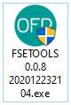
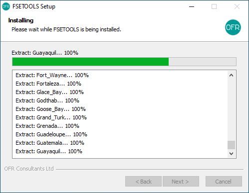

Windows
:::::::

Download FSETools installer and double click the installer.

You may see a pop-up dialog to uninstall any previous versions. Give it ten seconds after clicking the Yes button.

.. figure:: content/Setup/Setup-1.png
    :alt: Setup: Uninstall previous version

Click Next to start installation.

.. figure:: content/Setup/Setup-2.png
    :alt: Setup: Welcome

Wait till all files are unpacked.

Installation complete, click Finish to close the installer.

.. figure:: content/Setup/Setup-4.png
    :alt: Setup: Complete

After successful installation, you should able to run the application.

.. figure:: content/Setup/Setup-5.png
    :alt: Setup: FSETools

MAC OS
::::::

todo

Python
::::::

todo
