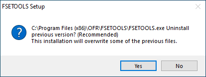
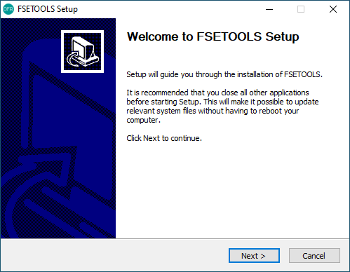
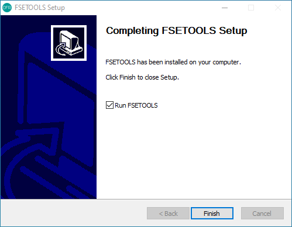
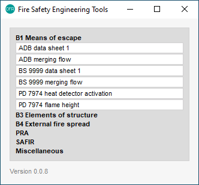

Windows
:::::::

Download FSETools installer and double click the installer.

.. figure:: content/Setup/Setup-0.png
    :alt: Setup: Installer

You may see a pop-up dialog to uninstall any previous versions. Give it ten seconds after clicking the Yes button.

Click Next to start installation.

Wait till all files are unpacked.

.. figure:: content/Setup/Setup-3.png
    :alt: Setup: Installing

Installation complete, click Finish to close the installer.

The application should be able to run.

MAC OS
::::::

*macOS Big Sur* is currently not supported due to a known `issue <https://github.com/pyinstaller/pyinstaller/issues/5107>`_.

`fsetoolsgui` will be updated to support *macOS Big Sur* once the above issue is fixed. Below are examples before the *Big Sur* update.

Python
::::::

See `fsetools <https://github.com/fsepy/fsetools>`_ and `SfePrapy <https://github.com/fsepy/sfeprapy>`_.
