Eurocode 1 Thermal Actions for External Members
***********************************************

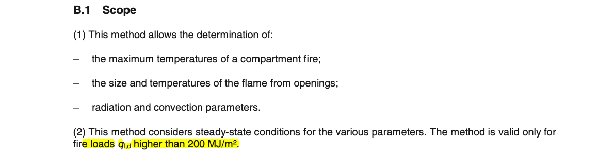

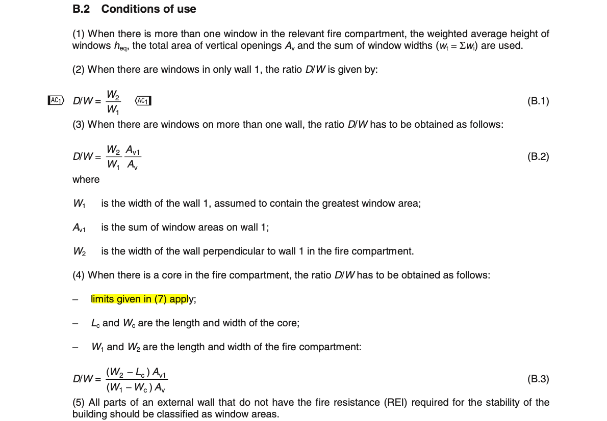

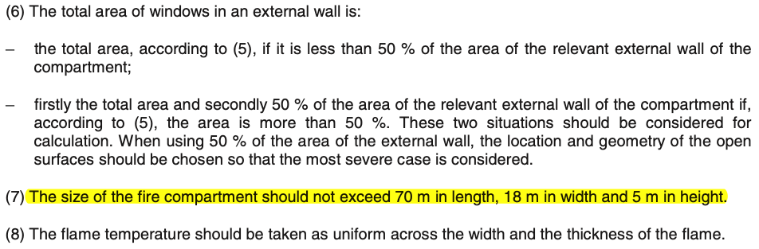

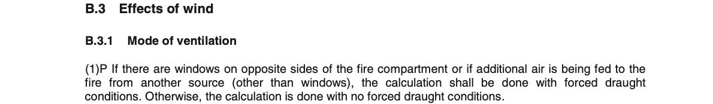

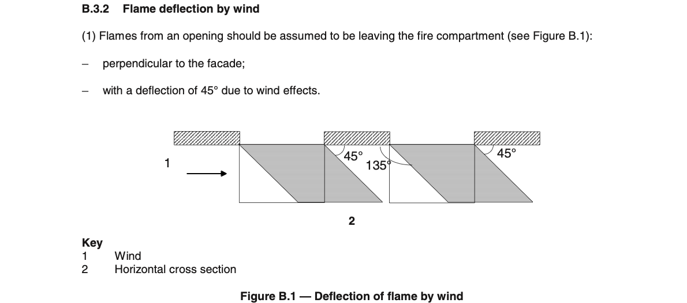

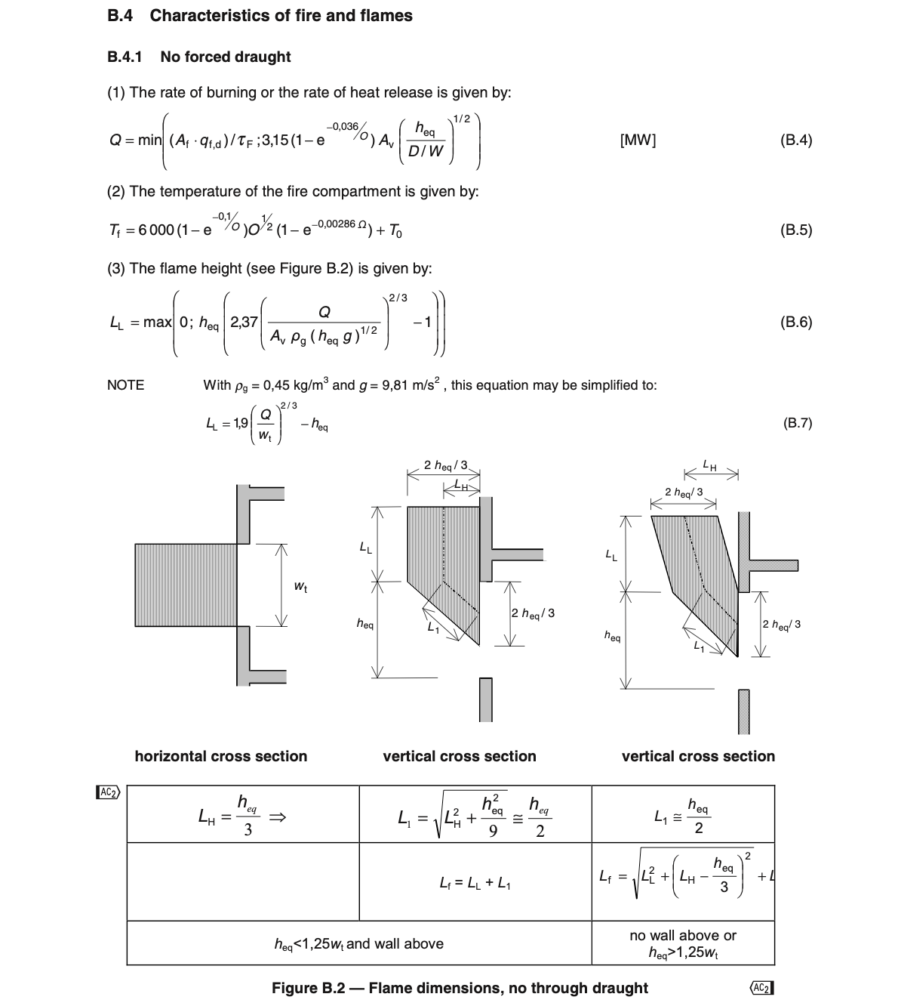

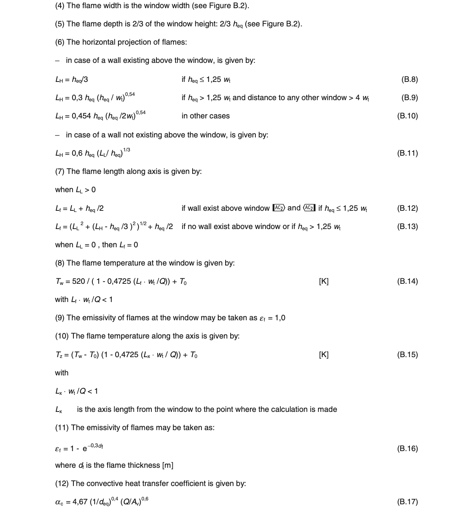

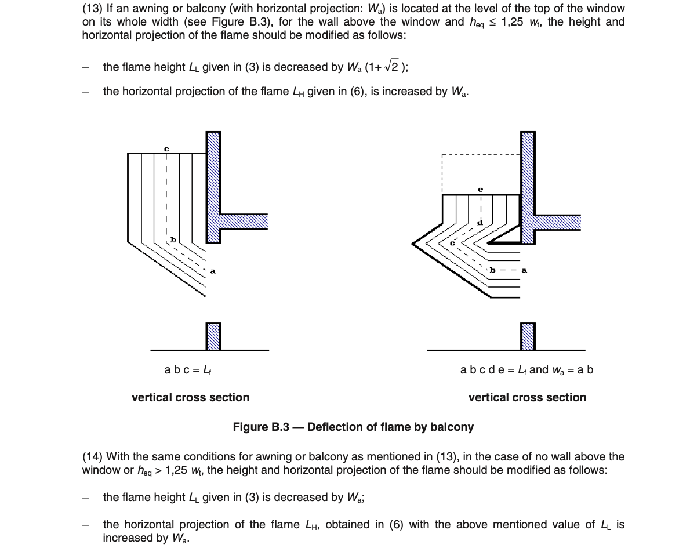

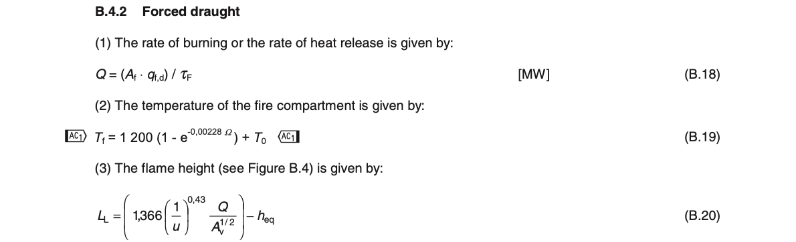

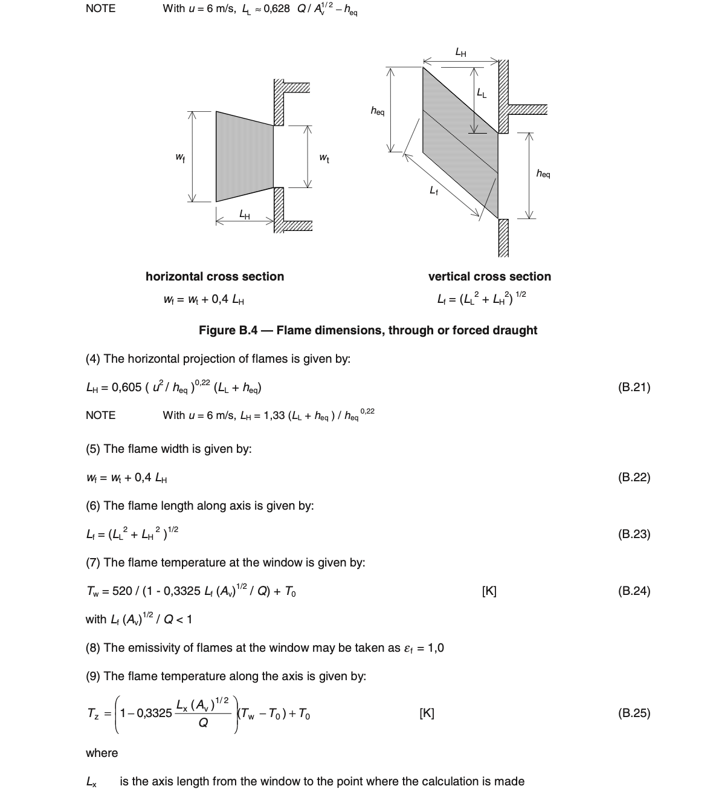

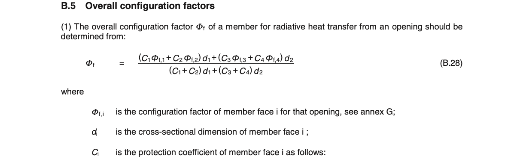

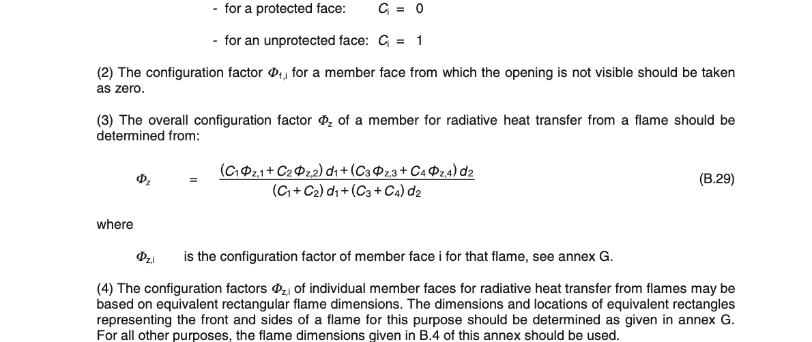

.. list-table::
    :header-rows: 1

    * - Date
      - Author
      - Checker
      - Remarks
    * - 2020/08/16
      - Ian F.
      - Ian F.
      - Initial