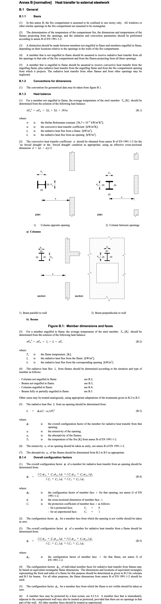
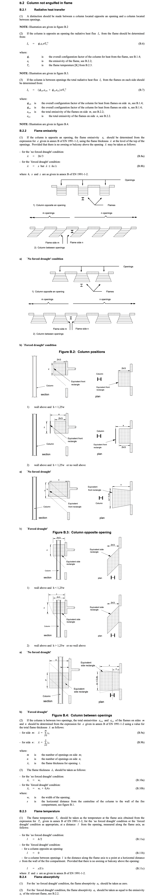
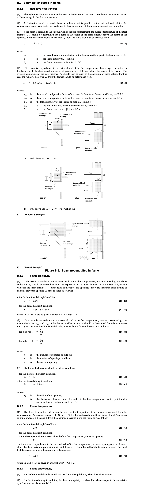
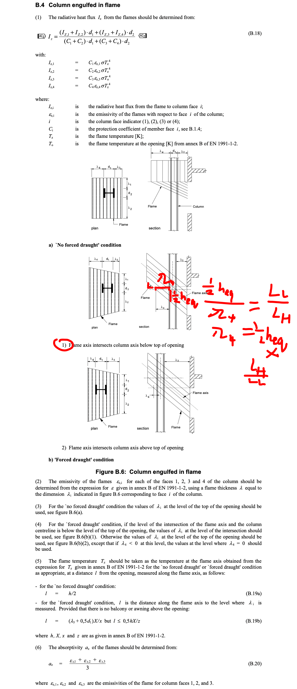
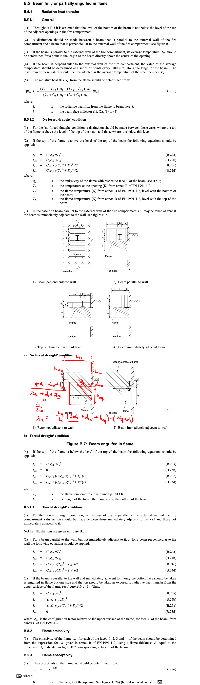

Eurocode 3 Heat Transfer to External Steelwork
**********************************************

Column not engulfed in flame
============================

Beam not engulfed in flame
==========================

Column engulfed in flame
========================

Beam fully or partially engulfed in flame
=========================================

