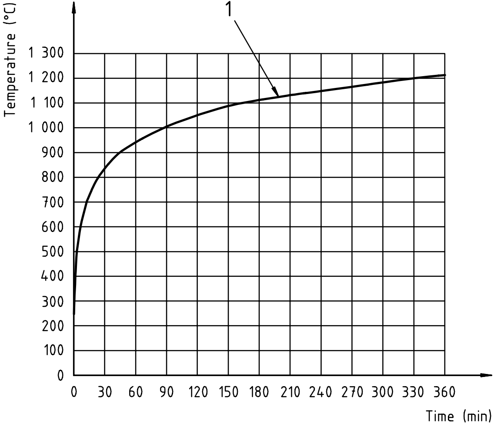

ISO 834 Standard Fire
*********************

The fire (time-temperature) curve used to define the furnace temperature in BS ISO 834-1 [1]_ tests. The ISO 834 series specifies a test method for determining the fire resistance of various elements of construction when subjected to the time dependent temperature conditions.

The standard fire curve is defined in Equation :eq:`standard-fire-curve` (Clause 6.1.1, ISO 834-1).

.. math::
    T=345\log_{10}\left(8t+1\right)+20
    :label: standard-fire-curve

where

    | :math:`T` is the average furnace temperature, in degrees Celsius;
    | :math:`t` is the time, in minutes.

:numref:`fig-standard-fire-curve` shows the standard fire curve derived based on Equation :eq:`standard-fire-curve`.

.. _fig-standard-fire-curve:

    Standard time/temperature curve (1 is the standard time-temperature curve, source: Figure 7, ISO 834-1)

.. [1]  BSI, *BS ISO 834-1:1999 Fire resistance tests. Elements of building construction. General requirements.*, BSI, London, Sep. 1991.
