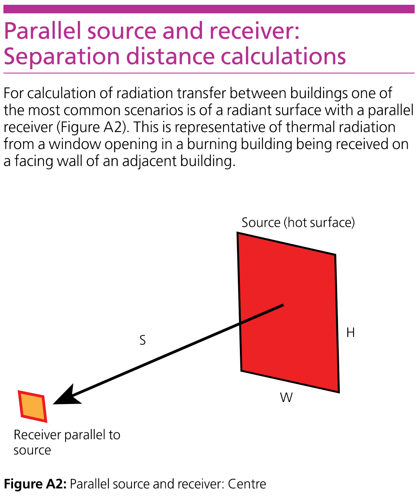
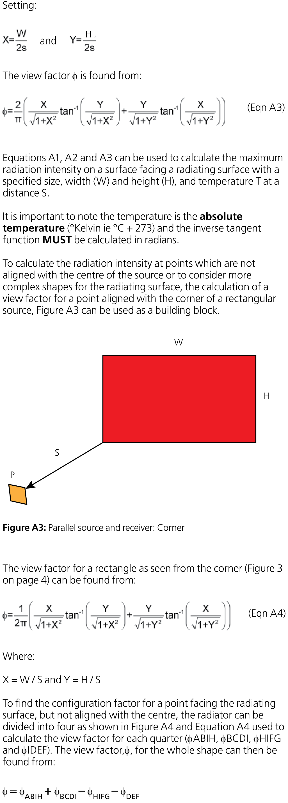
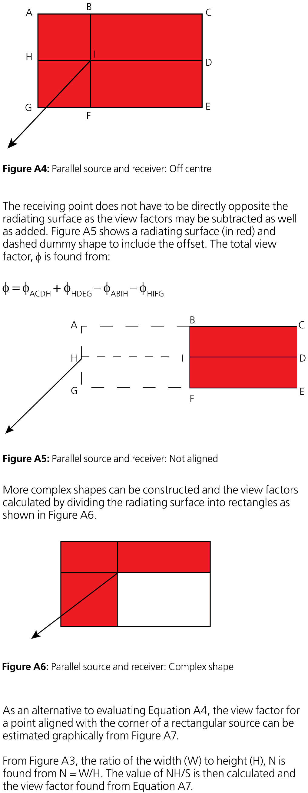
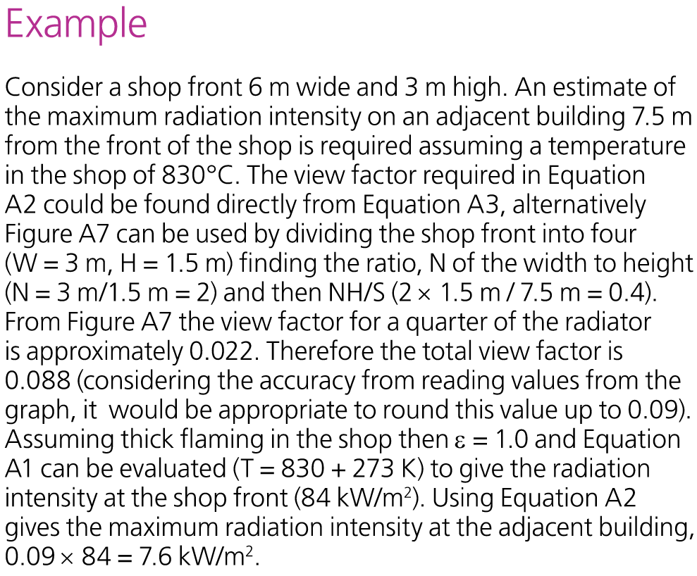

BR 187 Parallel Oriented Emitter and Receiver
*********************************************

.. list-table::
    :widths: 15 15 15 55
    :header-rows: 1

    * - Date
      - Author
      - Checker
      - Remarks
    * - 2020/03/11
      - Ian F.
      - Alex T.
      - Initial, parallel orientation receiver within emitter plane
    * - 2020/03/27
      - \-
      - Zak A.
      - Parallel orientation, receiver within and outside of emitter plane
