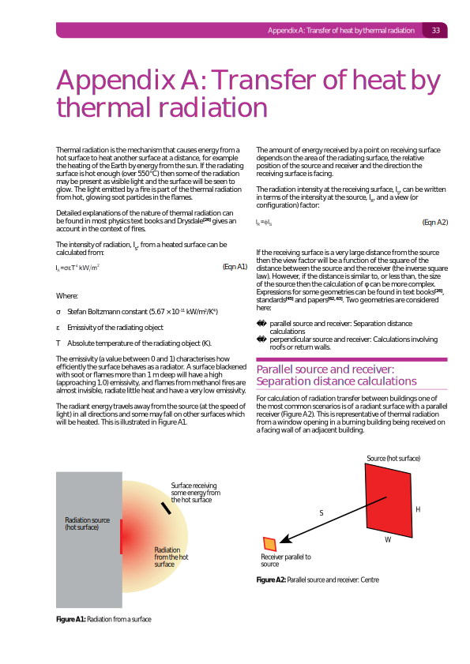
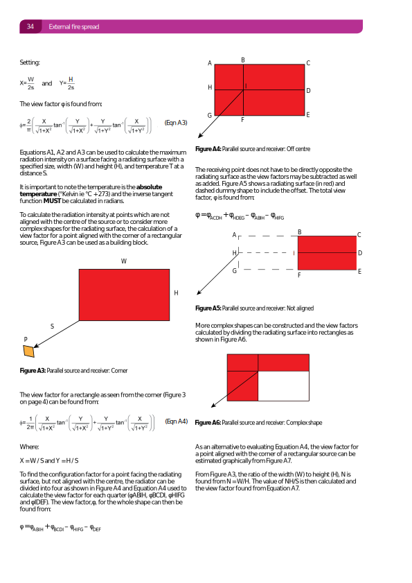
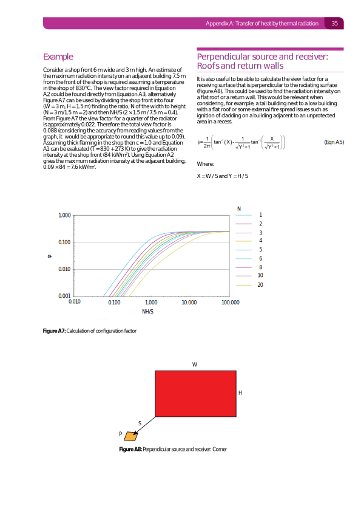
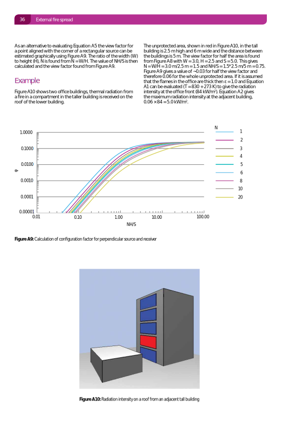

BR 187 Perpendicular oriented receiver
--------------------------------------

.. list-table::
    :header-rows: 1

    * - Date
      - Author
      - Checker
      - Remarks
    * - 2020/03/30
      - Ian F.
      - Zak A.
      - Initial
    * - 2020/07/31
      - \-
      - Danny H.
      - Compared against an independently derived results

Key equations:

.. math::
   \phi=\frac{1}{2\pi}\left(\tan^{-1}\left({X} \right )-\frac{1}{\sqrt{Y^2+1}}\tan^{-1}\left(\frac{X}{\sqrt{Y^2+1}} \right ) \right )

Where :math:`X=\frac{W}{S}` and :math:`Y=\frac{H}{S}`.

