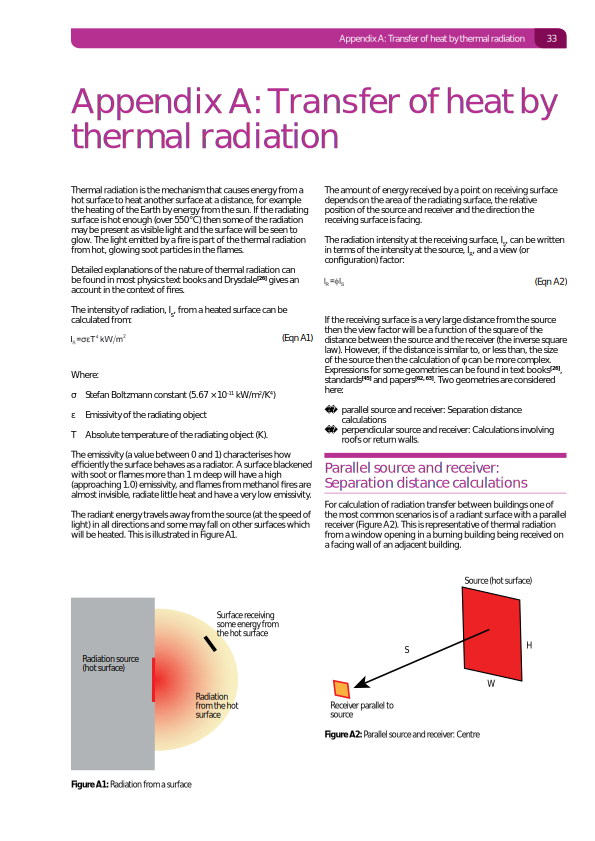
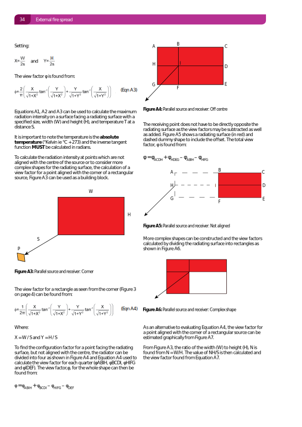
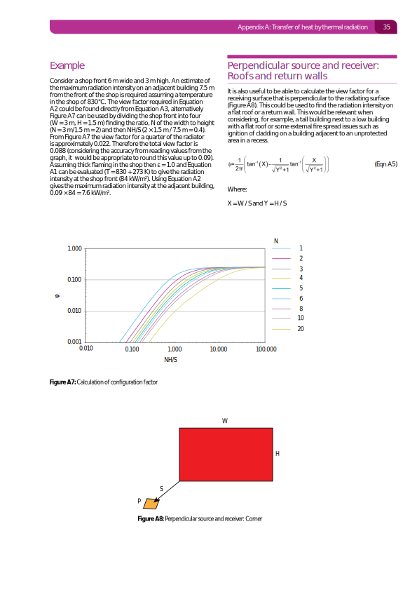
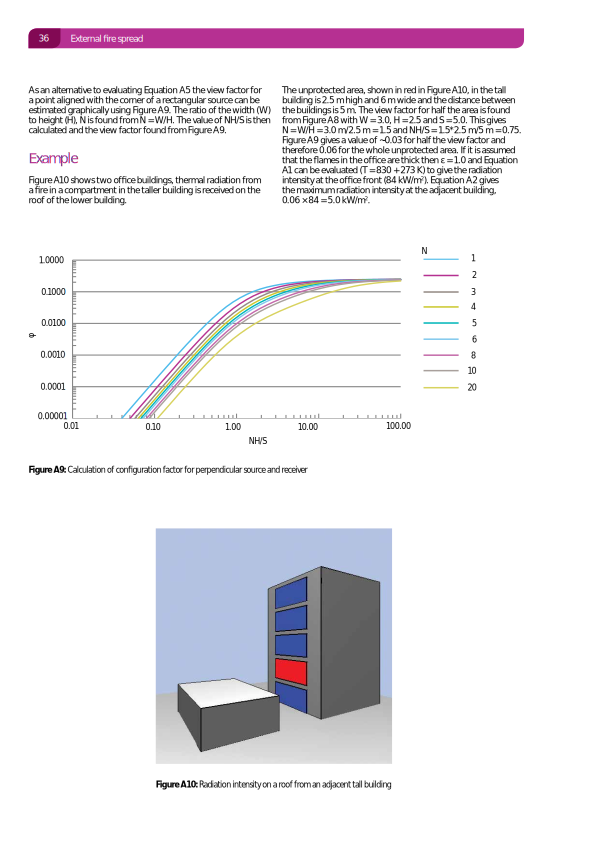

BR 187 Parallel oriented receiver
---------------------------------

.. list-table::
    :widths: 15 15 15 55
    :header-rows: 1

    * - Date
      - Author
      - Checker
      - Remarks
    * - 2020/03/11
      - Ian F.
      - Alex T.
      - Initial, parallel orientation receiver within emitter plane
    * - 2020/03/27
      - \-
      - Zak A.
      - Parallel orientation, receiver within and outside of emitter plane

Key equations:

.. math::
   \phi = \frac{1}{2\pi}\left(\frac{X}{\sqrt{1+X^2}}\tan^{-1}{\left(\frac{Y}{\sqrt{1+X^2}} \right )}+\frac{Y}{\sqrt{1+Y^2}}\tan^{-1}{\left(\frac{X}{\sqrt{1+Y^2}} \right )}\right)

Where :math:`X=\frac{W}{S}` and :math:`Y=\frac{H}{S}`.

