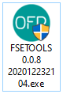
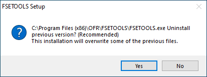
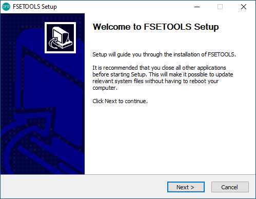
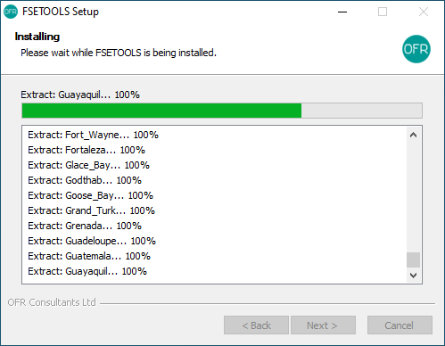
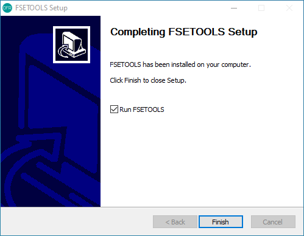
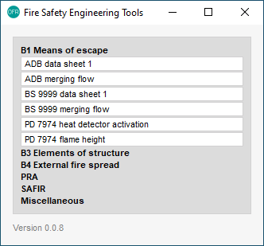

Installation
------------

Windows
:::::::

Download FSETools installer and double click the installer.

You may see a pop-up dialog to uninstall any previous versions. Give it ten seconds after clicking the Yes button.

Click Next to start installation.

Wait till all files are unpacked.

Installation complete, click Finish to close the installer.

After successful installation, you should able to run the application.

MAC OS
::::::

todo

Python
::::::

todo
