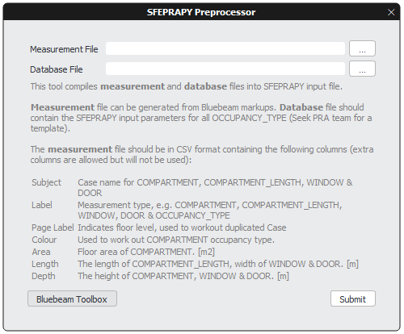
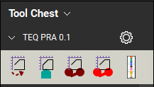
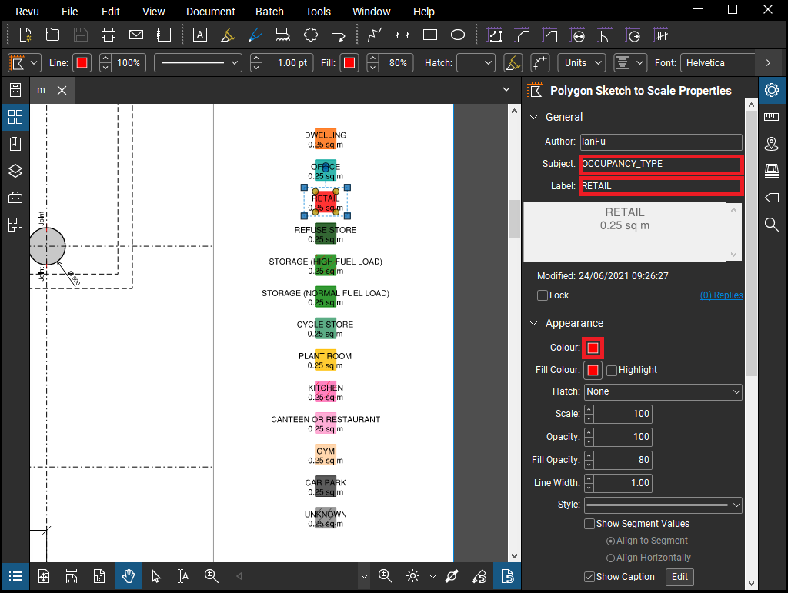
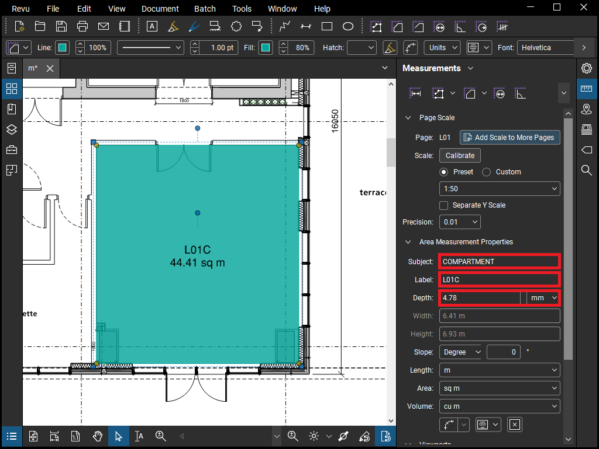
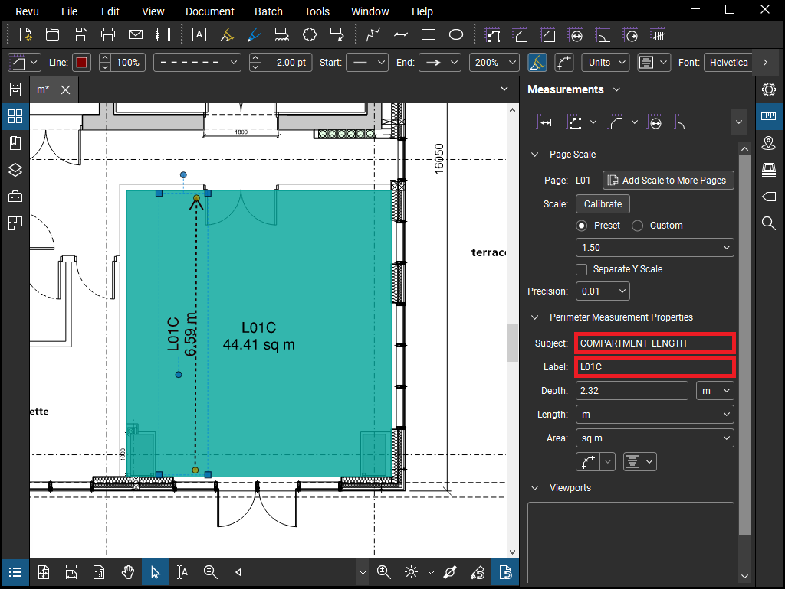
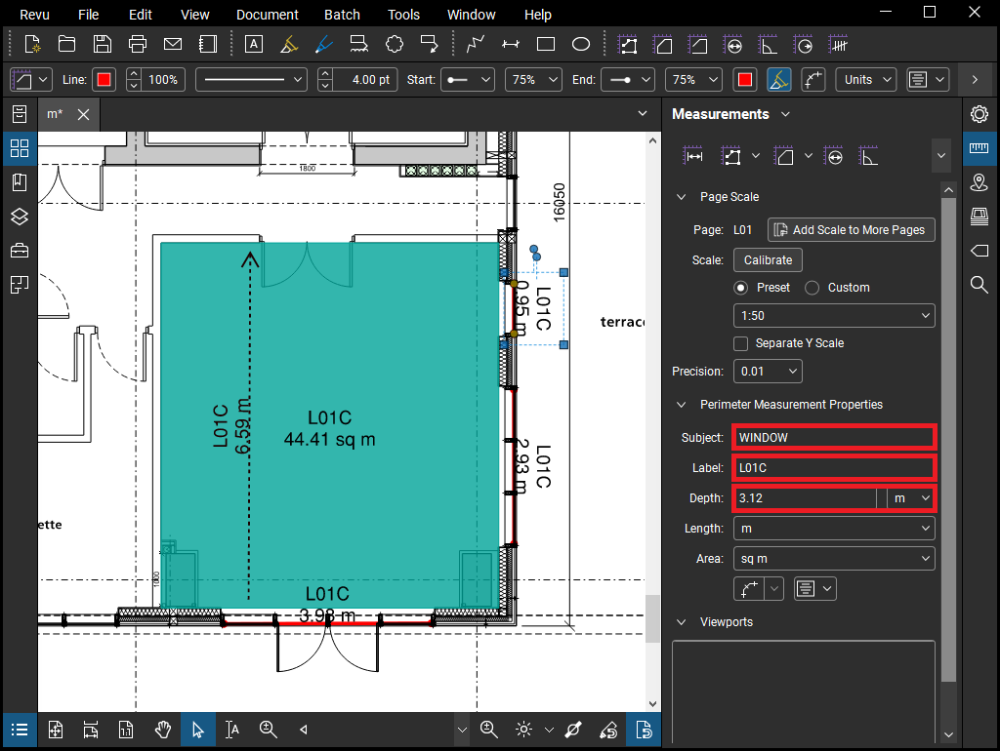
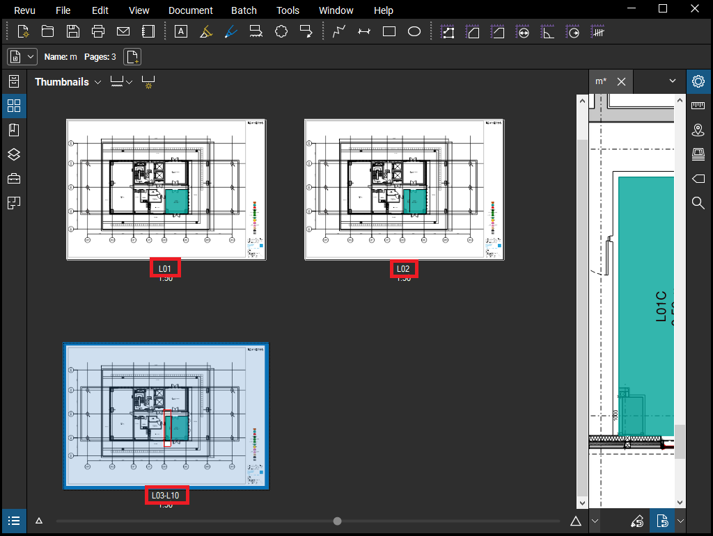
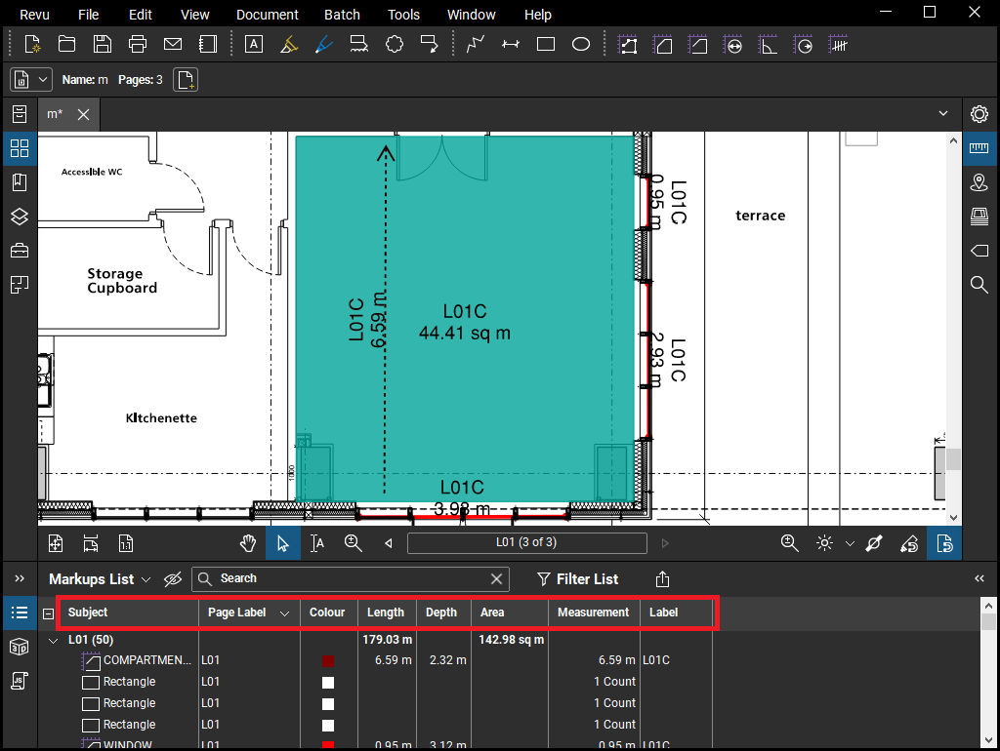
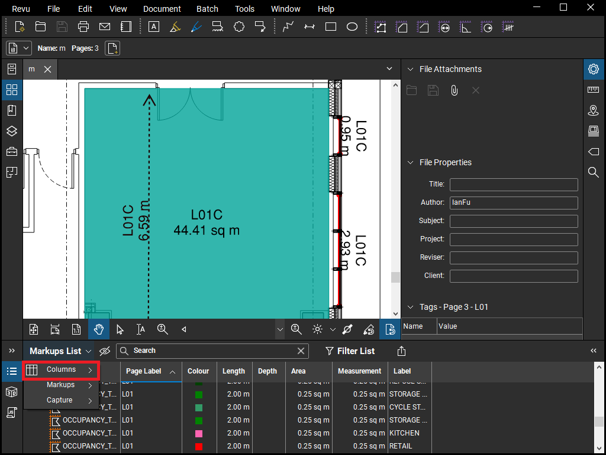
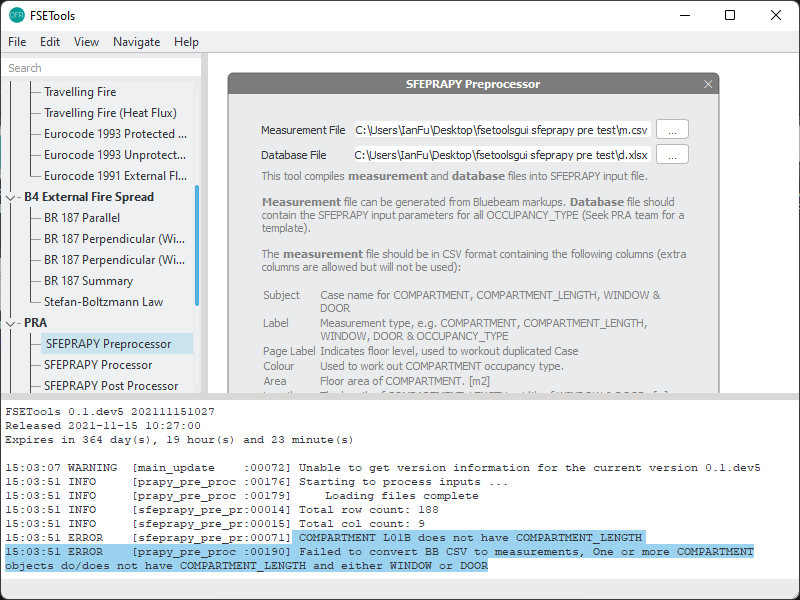

**************************
MCS0 Bluebeam Preprocessor
**************************

.. list-table::
    :header-rows: 1

    * - Date
      - Author
      - Checker
      - Remarks
    * - 2020/12/01
      - Ian F.
      - Ian F.
      - Initial
    * - 2021/11/15
      - Ieuan R., Zak A.
      - Ian F.
      - Update user guide

This guide describes how to use FSETools to generate SFEPRAPY input files in a semi-automated manner by utilising Bluebeam. This applet is designed to enhance the efficiency in both preparing and reviewing the input file by reducing the time spent and avoiding potential errors.

The process involves:
1. Prepare a Bluebeam markup containing specific information associated with fire compartment, occupancy characteristics and ventilation opening geometry.
2. Exporting a CSV file from the Bluebeam markup containing specific information.
3. To generate an SFEPRAPY input file using FSETools based on the CSV file (exported as above) and a database file containing fire characteristics and other parameters.

==============
Pre-requisites
==============
•	FSETools		Version 0.0.8 or later
•	Bluebeam		Version 20 or later

A database file for the design fire input parameters must also be created and this can be combined with the measurement CSV to produce an SFEPRAPY model input file. 

===============================
Installing the Bluebeam Toolbox
===============================
The Bluebeam toolbox can be installed from within the latest version of FSETOOLS. See below for where this is located.

This gives you a file that you can open in Bluebeam to give the following toolbox: 

The toolbox has preconfigured tools for measuring compartment area, travelling fire path, door area (compartments with no windows) and window area.

=============================
Preparing Markups In Bluebeam
=============================

-----------------------------------
To Create Occupancy Type Indicators
-----------------------------------
The legend  on the markups allows both the reader and FSETOOLS to connect colours with compartment types and the associated input parameters. For the legend you need an area with the subject “OCCUPANCY_TYPE”, the label of the occupancy type must correspond to the respective column name of the input database, see Section 5. The occupancy type of the legend and areas on the markups are connected by the edge line colour (not the shading). Occupancy types as an example from the legend of a project are shown below. The depth isn’t used.

A list of rectangle objects (can be regular markup or measurement objects) should be present in the PDF file. These are used later to pass the occupancy characteristics information that is indicated by their colours.

The following entries should be set appropriately:

-	Subject should be COMPARTMENT_TYPE to hint this object is used to indicate occupancy characteristics.
-	Name should be a unique string to represent the occupancy characteristic name (e.g., retail, office etc.).

-----------------------
To Create A Compartment
-----------------------
Markup a fire compartment by using area measurement in Bluebeam. Ensure the following are set appropriately:
-	Subject should be COMPARTMENT to hint this object is used to indicate a fire compartment.
-	Label should be a string to represent the associated case name (i.e., simulation case name in SFEPRAPY).
-	Depth should be set as the room (floor to soffit) height.
-	Color should match the occupancy characteristics as defined in Section 4.1.

Case name (i.e. Label) should be unique among all COMPARTMENT objects.

----------------------------
To Create A Fire Travel Path
----------------------------
Markup a fire travel path (or room depth) by using area measurement in Bluebeam. Ensure the following are set appropriately:

-	Subject should be COMPARTMENT_LENGTH to hint this object is used to indicate a fire travel path (or room depth).
-	Label should be a string to represent the associated case name (i.e., simulation case name in SFEPRAPY).

A compartment (or case name) can only have one COMPARTMENT_LENGTH.

------------------------------
To Create Ventilation Openings
------------------------------
Markup a fire compartment by using area measurement in Bluebeam. Ensure the following are set appropriately:
-	Subject should be WINDOW (or DOOR) to hint this object is used to indicate a window opening (or a door opening).
-	Label should be a string to represent the associated case name (i.e., simulation case name in SFEPRAPY).
-	Depth should be the window (or door) clear opening height.

Ensure all ventilation openings are appropriately marked up.

---------------------------------------------
Duplicate Compartments – Avoiding Remodelling
---------------------------------------------
For repeated compartments after taking all measurements for one, measure only the area again and assign the same compartment name but with an underscore at the end. For example, A1, A1_, A1_ would consider three of compartment type A1 without modelling it three times. This allows the proportion to be factored in for the overall building in distributions.

---------------
Repeated Floors
---------------
Where a floor plate repeats for example on levels 3 to 10 the drawing sheet for this can be named “L03-L10”

=============================
Exporting For Use In SFEPRAPY
=============================
Ensure the following headers are made visible when exporting.

To toggle headers for exporting:

==============
Database Files
==============
A database “d” file containing design fire input parameters for the different occupancy types is required. Ieuan or Ian can give you an example file to use and a template will be uploaded. 

==============================
Making The Sfeprapy Input File
==============================
FSETools automates the production of the input file for SFEPRAPY from the “m” and “d” files produced. 
Use the logbook located under miscellaneous to troubleshoot the production of the input files. In the example below there was no compartment length 

Following successful completion, the input files will be in the folder ready to run SFEPRAPY. 
Note: It is important to check that the total areas of each compartment type and the building align with expectations and that compartment sizes have not been affected by any scale issues. 
