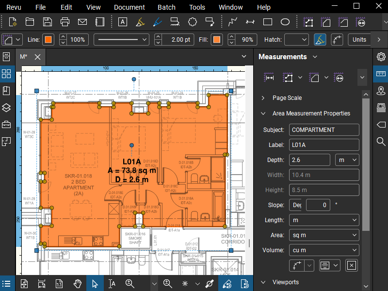

*********************
SFEPRAPY Preprocessor
*********************

This tool is designed to enhance the efficiency in both preparing and reviewing the input file by reducing the time spent and avoiding potential errors.

The process involves:
1. Prepare a Bluebeam markup containing specific information associated with fire compartment, occupancy characteristics and ventilation opening geometry.
2. Exporting a CSV file from the Bluebeam markup containing specific information.
3. To generate an SFEPRAPY input file using FSETools based on the CSV file (exported as above) and a database file containing fire characteristics and other parameters.

A database file for the design fire input parameters must also be created and this can be combined with the measurement CSV to produce an SFEPRAPY model input file.

To Add a Occupancy Type
=======================

.. warning::
    Work in progress

To Add a Compartment
====================

Markup a fire compartment by using area measurement in Bluebeam. Ensure the following are set appropriately:
-	Subject should be COMPARTMENT to hint this object is used to indicate a fire compartment.
-	Label should be a string to represent the associated case name (i.e., simulation case name in SFEPRAPY).
-	Depth should be set as the room (floor to soffit) height.
-	Color should match the occupancy characteristics as defined in Section 4.1.

Case name (i.e. Label) should be unique among all COMPARTMENT objects.

To Add a Fire Spread Path
=========================
Markup a fire travel path (or room depth) by using area measurement in Bluebeam. Ensure the following are set appropriately:

-	Subject should be COMPARTMENT_LENGTH to hint this object is used to indicate a fire travel path (or room depth).
-	Label should be a string to represent the associated case name (i.e., simulation case name in SFEPRAPY).

A compartment (or case name) can only have one COMPARTMENT_LENGTH.

To Add a Window
===============

Markup a fire compartment by using area measurement in Bluebeam. Ensure the following are set appropriately:
-	Subject should be WINDOW (or DOOR) to hint this object is used to indicate a window opening (or a door opening).
-	Label should be a string to represent the associated case name (i.e., simulation case name in SFEPRAPY).
-	Depth should be the window (or door) clear opening height.

Ensure all ventilation openings are appropriately marked up.

To Add a Door
=============

todo

Repeated Compartments
=====================

todo

Repeated Floors
===============

Where a floor plate repeats for example on levels 3 to 10 the drawing sheet for this can be named “L03-L10”

.. image:: duplicated_levels.png
  :alt: Duplicated levels

To Export Measurement File `m.csv`
==================================

Ensure the following headers are made visible when exporting.

To toggle headers for exporting:

.. image:: MEASUREMENT_FILE-toggle_columns.png
  :alt: MEASUREMENT_FILE toggle columns

Database File `d.xlsx`
======================

A database “d” file containing design fire input parameters for the different occupancy types is required. Ieuan or Ian can give you an example file to use and a template will be uploaded.

To Make SFEPRAPY Input File
===========================
FSETools automates the production of the input file for SFEPRAPY from the “m” and “d” files produced. 
Use the logbook located under miscellaneous to troubleshoot the production of the input files. In the example below there was no compartment length 

Following successful completion, the input files will be in the folder ready to run SFEPRAPY. 
Note: It is important to check that the total areas of each compartment type and the building align with expectations and that compartment sizes have not been affected by any scale issues. 
